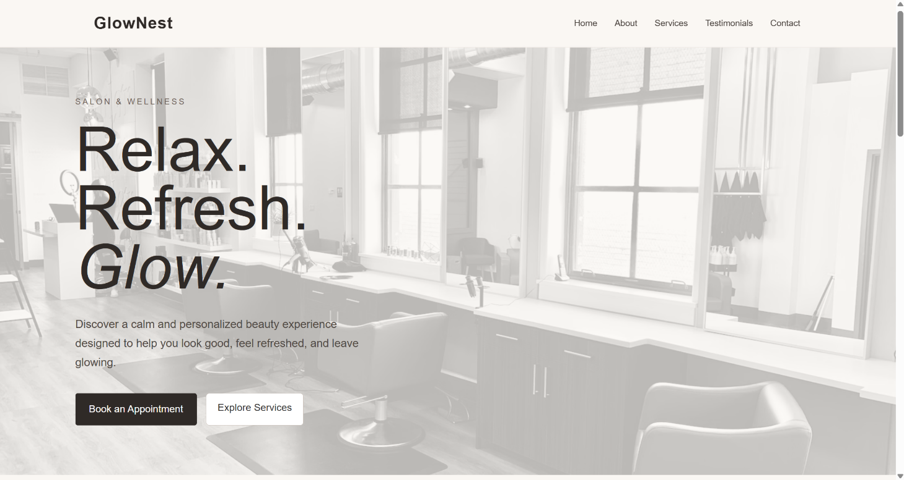
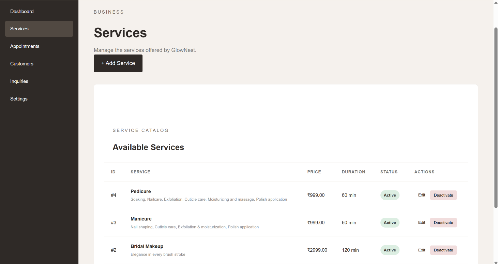
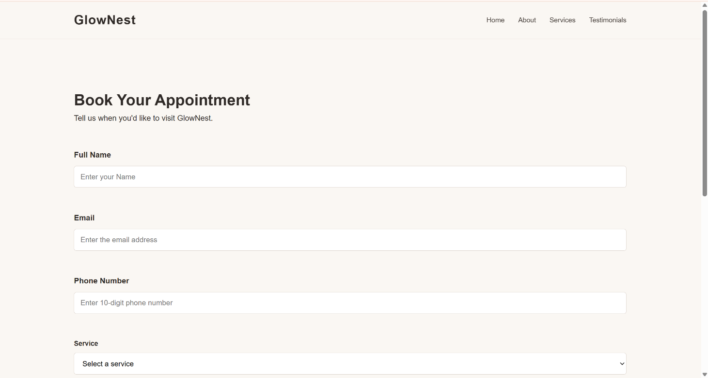
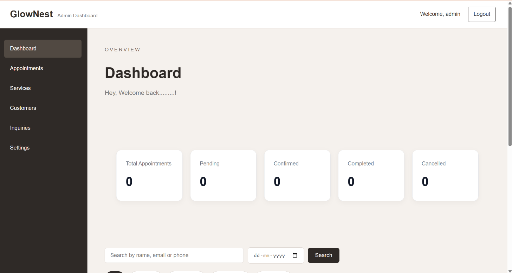

# GlowNest — Salon & Wellness Appointment Website

GlowNest is a full-stack salon and wellness appointment management website built with Python and Flask.

It allows customers to explore available services and book appointments, while administrators can manage services, appointments, and appointment statuses through a secure admin dashboard.

## 🌐 Live Demo

[View Live Demo](https://glownest-l9ro.onrender.com)

> Note: The demo is hosted on Render's free tier, so the application may take a short time to start after a period of inactivity.

## ✨ Features

### Customer Features

- Responsive salon and wellness website
- Service listings
- Online appointment booking
- Form validation
- Appointment success confirmation
- Responsive design for desktop and mobile

### Admin Features

- Secure admin authentication
- Admin dashboard
- Appointment management
- Appointment status updates
- Service management
- Add, edit, and activate/deactivate services
- Search and filtering
- Flash messages for user feedback

### Security

- CSRF protection
- Password hashing
- Rate-limited admin login
- Environment variables for sensitive configuration

## 🛠️ Technologies

- Python
- Flask
- Flask-SQLAlchemy
- Flask-Login
- Flask-WTF
- SQLite
- HTML5
- CSS3
- JavaScript
- Git & GitHub
- Render

## 📸 Screenshots

### Home Page



### Services



### Appointment Booking



### Admin Dashboard



## 📁 Project Structure

```text
GlowNest/
├── static/
│   └── css/
├── templates/
│   ├── admin/
│   ├── appointment.html
│   ├── appointment_success.html
│   ├── index.html
│   └── ...
├── screenshots/
│   ├── home.png
│   ├── services.png
│   ├── appointment.png
│   └── admin-dashboard.png
├── app.py
├── create_admin.py
├── requirements.txt
├── .python-version
├── .env.example
└── README.md